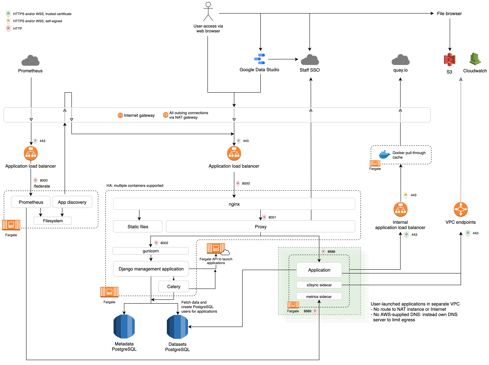

# Data Workspace [](https://circleci.com/gh/uktrade/data-workspace)

Allows users to launch applications in order to analyse data



## Running locally

Set the required variables by

```bash
cp .envs/sample.env .envs/dev.env
```

and edit `dev.env`, specifically replacing `AUTHBROKER_*`. Start the application by

```bash
docker-compose -f docker-compose-dev.yml up --build
```

With the default environment, you will need the below in your `/etc/hosts` file.

```
127.0.0.1       dataworkspace.test
```

And the application will be visible at http://dataworkspace.test:8000. This is to be able to properly test cookies that are shared with subdomains. To run tool and visualisation-related code, you will need subdomains in your `/etc/hosts` file, such as 

```
127.0.0.1       visualisation-a.dataworkspace.test
```

Some parts of the database are managed and populated by [data-flow](https://github.com/uktrade/data-flow/). To ensure there are no issues with some tables being missing, initial setup should include checking out that repo and running the `docker-compose-dw.yml` file, which will perform migrations on the shared Data Workspace/Data Flow DB.


## Running superset locally

There is a separate compose file to run superset as it's not necessary to run it locally all the time.

To get started you will need to create an env file

```bash
cp .envs/superset-sample.env .envs/superset.dev.env
```

Update the new file with your dit email address (must match your SSO email).

Then run docker-compose using both the dev and dev superset compose files

```bash
docker-compose -f docker-compose-dev.yml -f docker-compose-superset-dev.yml up
```

Initially you will then need to set up the Editor role by running the following script, replacing container-id with the id of the data-workspace-postgres docker container:

```bash
docker exec -i <container-id> psql -U postgres -d superset < superset/create-editor-role.sql
```

After placing the following lines in /etc/hosts:

```
127.0.0.1       superset-admin.dataworkspace.test
127.0.0.1       superset-edit.dataworkspace.test
```

you can then visit http://superset-edit.dataworkspace.test:8000/ or http://superset-admin.dataworkspace.test:8000/


## Creating migrations / running management commands

```bash
docker-compose build && \
docker-compose run \
    --user root \
    --volume=$PWD/dataworkspace:/dataworkspace/ \
    data-workspace django-admin makemigrations
```

For other commands, replace `makemigrations` with the name of the command.


## Debugging in docker

See the [remote debugging docs](./docs/Remote%20Debugging.md)

## Running tests

```bash
make docker-test
```

Django tests
```bash
make docker-test-unit
```

### Running unit and integration tests locally

To run the tests locally without having to rebuild the containers every time append `-local` to the test make commands

```bash
make docker-test-unit-local
```

```bash
make docker-test-integration-local
```

```bash
make docker-test-local
```

To run specific tests pass `-e TARGET=<test>` into make
```bash
make docker-test-unit-local -e TARGET=dataworkspace/dataworkspace/tests/test_admin.py::TestCustomAdminSite::test_non_admin_access
 ```

```bash
make docker-test-integration-local -e TARGET=test/test_application.py
 ```

### Running selenium tests locally

We have some selenium integration tests that launch a (headless) browser in order to interact with a running instance of Data Workspace to assure some core flows (only Data Explorer at the time of writing). It is sometimes desirable to watch these tests run, e.g. in order to debug where it is failing. To run the selenium tests through docker-compose using a local browser, do the following:

1) Download the latest [Selenium Server](https://www.selenium.dev/downloads/) and run it in the background, e.g. `java -jar ~/Downloads/selenium-server-standalone-3.141.59 &`
2) Run the selenium tests via docker-compose, exposing the Data Workspace port and the mock-SSO port and setting the `REMOTE_SELENIUM_URL` environment variable, e.g. `docker-compose -f docker-compose-test.yml -p data-workspace-test run -e REMOTE_SELENIUM_URL=http://host.docker.internal:4444/wd/hub -p 8000:8000 -p 8005:8005 --rm data-workspace-test pytest -vvvs test/test_selenium.py`

## Updating a dependency

We use [pip-tools](https://github.com/jazzband/pip-tools) to manage dependencies across two files - `requirements.txt` and `requirements-dev.txt`. These have corresponding `.in` files where we specify our top-level dependencies.

Add the new dependencies to those `.in` files, or update an existing dependency, then (with `pip-tools` already installed), run `make save-requirements`.

## Running the chart builder react app locally

We're set up to use django-webpack-loader for hotloading the react app while developing. 

You can get it running by starting the dev server:

```shell
docker-compose -f docker-compose-dev.yml up
```

and in a separate terminal changing to the js app directory and running the webpack hotloader:

```shell
cd dataworkspace/dataworkspace/static/js/chart-builder/
npm run dev
```

For production usage we use pre-built javascript bundles to reduce the pain of having to build npm modules at deployment.

If you make any changes to the react apps you will need to rebuild and commit the bundles. 
This will create the relevant js files in `/static/js/bundles/` directory.

```shell
cd dataworkspace/dataworkspace/static/js/chart-builder/
npm run build
git add ../bundles/*.js
```


# Infrastructure

The infrastructure is heavily Docker/Fargate based. Production Docker images are built by [quay.io](https://quay.io/organization/uktrade).


## User-facing components

- [Main application](https://quay.io/repository/uktrade/data-workspace)
  A Django application to manage datasets and permissions, launch containers, a proxy to route requests to those containers, and an NGINX instance to route to the proxy and serve static files.

- [JupyterLab](https://quay.io/repository/uktrade/data-workspace-jupyterlab)
  Launched by users of the main application, and populated with credentials in the environment to access certain datasets.

- [rStudio](https://quay.io/repository/uktrade/data-workspace-rstudio)
  Launched by users of the main application, and populated with credentials in the environment to access certain datasets.

- [pgAdmin](https://quay.io/repository/uktrade/data-workspace-pgadmin)
  Launched by users of the main application, and populated with credentials in the environment to access certain datasets.

- File browser:
  A single-page-application that offers upload and download of files to/from each user's folder in S3. The data is transferred directly between the user's browser and S3.


## Infrastructure components

- [metrics](https://quay.io/repository/uktrade/data-workspace-metrics)
  A sidecar-container for the user-launched containers that exposes metrics from the [ECS task metadata endpoint](https://docs.aws.amazon.com/AmazonECS/latest/developerguide/task-metadata-endpoint-v3.html) in Prometheus format.

- [s3sync](https://quay.io/repository/uktrade/data-workspace-s3sync)
  A sidecar-container for the user-launched containers that syncs to and from S3 using [mobius3](https://github.com/uktrade/mobius3). This is to allow file-persistance on S3 without using FUSE, which at the time of writing is not possible on Fargate.

- [dns-rewrite-proxy](https://quay.io/repository/uktrade/data-workspace-dns-rewrite-proxy)
  The DNS server of the VPC that launched containers run in. It selectivly allows only certain DNS requests through to migitate chance of data exfiltration through DNS. When this container is deployed, it changes DHCP settings in the VPC, and will most likely break aspects of user-launched containers.

- [healthcheck](https://quay.io/repository/uktrade/data-workspace-healthcheck)
  Proxies through to the healthcheck endpoint of the main application, so the main application can be in a security group locked-down to certain IP addresses, but still be monitored by Pingdom.

- [mirrors-sync](https://quay.io/repository/uktrade/data-workspace-mirrors-sync)
  Mirrors pypi, CRAN and (ana)conda repositories to S3, so user-launched JupyterLab and rStudio containers can install packages without having to contact the public internet.

- [prometheus](https://quay.io/repository/uktrade/data-workspace-prometheus)
  Collects metrics from user-launched containers and re-exposes them through federation.

- [registry](https://quay.io/repository/uktrade/data-workspace-registry)
  A Docker pull-through-cache to repositories in [quay.io](https://quay.io/organization/uktrade). This allows the VPC to not have public internet access but still launch containers from quai.io in Fargate.

- [sentryproxy](https://quay.io/repository/uktrade/data-workspace-sentryproxy)
  Proxies errors to a Sentry instance: only used by JupyterLab.


## Application lifecycle

As an example, from the point of view of user `abcde1234`, `https://jupyterlab-abcde1234.mydomain.com/` is the fixed address of their private JupyterLab application. Going to `https://jupyterlab-abcde1234.mydomain.com/` in a browser will

- show a starting screen with a countdown;
- and when the application is loaded, the page will reload and show the application itself;
- and subsequent loads will show the application immediately.

If the application is stopped, then a visit to `https://jupyterlab-abcde1234.mydomain.com/` will repeat the process. The user will never leave `https://jupyterlab-abcde1234.mydomain.com/`. If the user visits `https://jupyterlab-abcde1234.mydomain.com/some/path`, they will also remain at `https://jupyterlab-abcde1234.mydomain.com/some/path` to ensure, for example, bookmarks to any in-application page work even if they need to start the application to view them.

The browser will only make GET requests during the start of an application. While potentially a small abuse of HTTP, it allows the straightfoward behaviour described: no HTML form or JavaScript is required to start an application [although JavaScript is used to show a countdown to the user and to check if an application has loaded]; and the GET requests are idempotent.

The proxy however, has a more complex behaviour. On an incoming request from the browser for `https://jupyterlab-abcde1234.mydomain.com/`:

- it will attempt to `GET` details of an application with the host `jupyterlab-abcde1234` from an internal API of the main application;
- if the `GET` returns a 404, it will make a `PUT` request to the main application that initiates creation of the Fargate task;
- if the `GET` returns a 200, and the details contain a URL, the proxy will attempt to proxy the incoming request to it;
- it does not treat errors connecting to a `SPAWNING` application as a true error: they are effectely swallowed.
- if an application is returned from the `GET` as `STOPPED`, which happens on error, it will `DELETE` the application, and show an error to the user.

The proxy itself _only_ responds to incoming requests from the browser, and has no long-lived tasks that go beyond one HTTP request or WebSockets connection. This ensures it can be horizontally scaled.


## Why the custom proxy?

A common question is why not just NGINX instead of the custom proxy? The reason is the dynamic routing for the applications, e.g. URLs like https://jupyterlab-abcde1234.mydomain.com/some/path: each one has a lot of fairly complex requirements.

- It must redirect to SSO if not authenticated, and redirect back to the URL once authenticated.
- It must perform ip-filtering that is not applicable to the main application.
- It must check that the current user is allowed to access the application, and show a forbidden page if not.
- It must start the application if it's not started.
- It must show a starting page with countdown if it's starting.
- It must detect if an application has started, and route requests to it if it is.
- It must route cookies from _all_ responses back to the user. For JupyterLab, the _first_ response contains cookies used in XSRF protection that are never resent in later requests.
- It must show an error page if there is an error starting or connecting to the application.
- It must allow a refresh of the error page to attempt to start the application again.
- It must support WebSockets, without knowledge ahead of time which paths are used by WebSockets.
- It must support streaming uploads and downloads.
- Ideally, there would not be duplicate reponsibilities between the proxy and other parts of the system, e.g. the Django application.

While not impossible to leverage NGINX to move some code from the proxy, there would still need to be custom code, and NGINX would have to communicate via some mechanism to this custom code to acheive all of the above: extra HTTP or Redis requests, or maybe through a custom NGINX module. It is suspected that this will make things more complex rather than less, and increase the burden on the developer.


## Why is the proxy written using asyncio?

- The proxy fits the typical use-case of event-loop based programming: low CPU but high IO requirements, with potentially high number of connections.

- The asyncio library aiohttp provides enough low-level control over the headers and the bytes of requests and responses to work as a controllable proxy. For example, the typical HTTP request cycle can be programmed fairly explicitly.

  - An incoming request begins: its headers are received.
  - The proxy makes potentially several requests to the Django application, to Redis, and/or to SSO to authenticate and determine where to route the request.
  - The incoming request's headers are passed to the application [removing certain hop-by-hop-headers].
  - The incoming request's body is streamed to the application.
  - The response headers are sent back to the client, combining cookies from the application and from the proxy.
  - The response body is streamed back to the client.

  The library also allows for receiving and making WebSockets requests. This is done without knowledge ahead of time which path is WebSockets, and which is HTTP. This is something that doesn't seem possible with, for example, Django Channels.

  Requests and responses can be of the order of several GBs, so this streaming behaviour is a critical requirement.

- Django gives a lot of benefits for the main application: for example, it is within the skill set of most available developers. Only a small fraction of changes need to involve the proxy.


## Comparison with JupyterHub

In addition to being able to run any Docker container, not just JupyterLab, Data Workspace has some deliberate architectural features that are different to JupyterHub.

- All state is in the database, accessed by the main Django application.

- Specifically, no state is kept in the memory of the main Django application. This means it can be horizontally scaled without issue.

- The proxy is also stateless: if fetches how to route requests from the main application, which itself fetches the data from the database. This means it can also be horizontally scaled without issue, and potentially independently from the main application. This means sticky sessions are not needed, and multiple users could access the same application, which is a planned feature for user-supplied visualisation applications.

- Authentication is completely handled by the proxy. Apart from specific exceptions like the healthcheck, non-authenticated requests do not reach the main application.

- The launched containers do not make requests to the main application, and the main application does not make requests to the launched containers. This means there are fewer cyclic dependencies in terms of data flow, and that applications don't need to be customised for this environment. They just need to open a port for HTTP requests, which makes them extremely standard web-based Docker applications.

There is a notable exception to the statelessness of the main application: the launch of an application is made of a sequence of calls to AWS, and is done in a Celery task. If this sequence is interrupted, the launch of the application will fail. This is a solvable problem: the state could be saving into the database and sequence resumed later. However, since this sequence of calls lasts only a few seconds, and the user will be told of the error and can refresh to try to launch the application again, at this stage of the project this has been deemed unnecessary.
