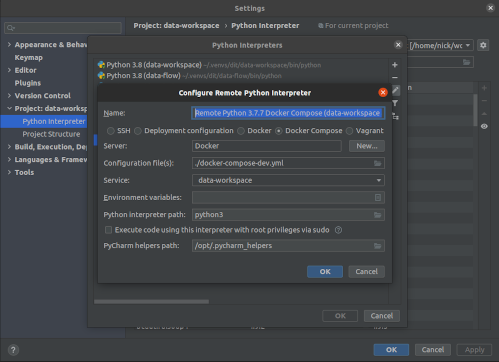
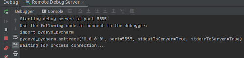
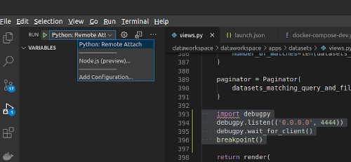

# Remote debugging docker containers

## PDB

As `ipdb` has some issues with gevent and monkey patching we are only able to debug using vanilla `pdb` currently.

To set this up locally.

1. Install remote-pdb-client `pip install remote-pdb-client` or just `pip install -r requirements-dev.txt` 
2. Ensure you have the following in `dev.env`
    - `PYTHONBREAKPOINT=remote_pdb.set_trace`
    - `REMOTE_PDB_HOST=0.0.0.0`
    - `REMOTE_PDB_PORT=4444`
3. Sprinkle some `breakpoint()`s liberally in your code
4. Bring up the docker containers ` docker compose -f docker-compose.yml up` 
5. Listen to remote pdb using `remotepdb_client --host localhost --port 4444`
6. Go and break things http://dataworkspace.test:8000

## Pycharm

To debug via the pycharm remote debugger you will need to jump through a few hoops.

1. Configure `docker-compose.yml` as a remote interpreter.  
    

2. Configure a python debug server for `pydev-pycharm` to connect to. You will need to ensure the path mapping 
is set to the path of your dev environment.  
    

3. Bring up the containers  
    ` docker compose -f docker-compose.yml up`

4. Start the pycharm debugger  
    

5. Add a breakpoint using pydev-pycharm  
    

4. Profit  
    

## VSCode

Below are the basic steps for debugging remotely with vscode. They are confirmed to work but may needs some tweaks so feel free to update the docs.

1. Install the Docker and Python debug plugins
2. Add a remote debug configuration to your `launch.json`
    ```json
    {
      "configurations": [
        {
          "name": "Python: Remote Attach",
          "type": "python",
          "request": "attach",
          "connect": {
            "host": "0.0.0.0",
            "port": 4444
          },
          "pathMappings": [
            {
              "localRoot": "${workspaceFolder}/dataworkspace",
              "remoteRoot": "/dataworkspace"
            }
          ]
        }
      ]
    }
    ```
3. Add the following code snippet to the file that you wish to debug  
    ```python
    import debugpy
    debugpy.listen(('0.0.0.0', 4444))
    debugpy.wait_for_client()
    ```
4. Set a breakpoint in your code  
    `breakpoint()`
5. Bring up the containers  
    ` docker compose -f docker-compose.yml up`
6. Start the remote python debugger  
    
7. Load the relevant page http://dataworkspace.test:8000
8. Start debugging  
    
