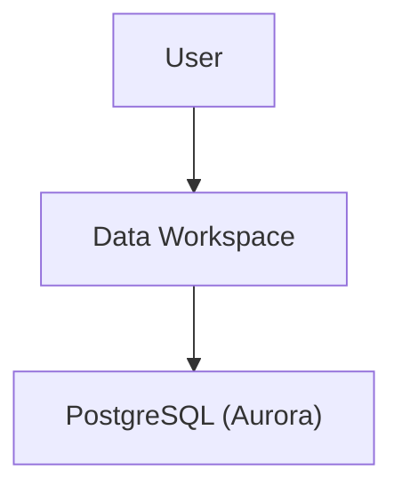
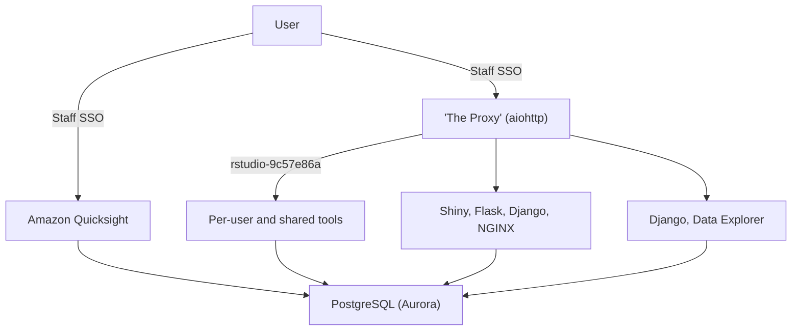

--8<-- "README.md:architecture"

## Architecture Diagrams

### High Level

At the highest level, users access the Data Workspace application, which accesses a PostgreSQL database.

### Medium Level

--8<-- "README.md:userfacingcomponents"
--8<-- "README.md:infrastructurecomponents"
--8<-- "README.md:applicationlifecycle"
--8<-- "README.md:customproxy"
--8<-- "README.md:asyncio"
--8<-- "README.md:jupyterhubcomparison"