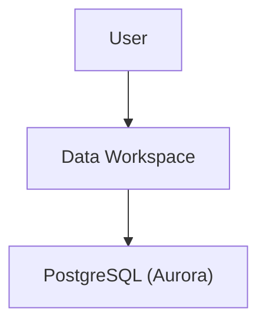
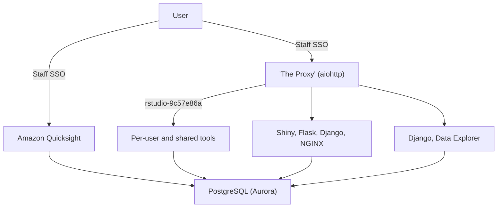

<!-- --8<-- [start:architecture] -->
## Architecture

The architecture is heavily Docker/Fargate based.
<!-- --8<-- [end:architecture] -->

## Architecture Diagrams

### High Level

At the highest level, users access the Data Workspace application, which accesses a PostgreSQL database.

### Medium Level

## User-facing components

- [Main application](https://quay.io/repository/uktrade/data-workspace)
  A Django application to manage datasets and permissions, launch containers, a proxy to route requests to those containers, and an NGINX instance to route to the proxy and serve static files.

- [JupyterLab](https://quay.io/repository/uktrade/data-workspace-jupyterlab)
  Launched by users of the main application, and populated with credentials in the environment to access certain datasets.

- [rStudio](https://quay.io/repository/uktrade/data-workspace-rstudio)
  Launched by users of the main application, and populated with credentials in the environment to access certain datasets.

- [pgAdmin](https://quay.io/repository/uktrade/data-workspace-pgadmin)
  Launched by users of the main application, and populated with credentials in the environment to access certain datasets.

- File browser:
  A single-page-application that offers upload and download of files to/from each user's folder in S3. The data is transferred directly between the user's browser and S3.

## Infrastructure components

- [metrics](https://quay.io/repository/uktrade/data-workspace-metrics)
  A sidecar-container for the user-launched containers that exposes metrics from the [ECS task metadata endpoint](https://docs.aws.amazon.com/AmazonECS/latest/developerguide/task-metadata-endpoint-v3.html) in Prometheus format.

- [s3sync](https://quay.io/repository/uktrade/data-workspace-s3sync)
  A sidecar-container for the user-launched containers that syncs to and from S3 using [mobius3](https://github.com/uktrade/mobius3). This is to allow file-persistance on S3 without using FUSE, which at the time of writing is not possible on Fargate.

- [dns-rewrite-proxy](https://quay.io/repository/uktrade/data-workspace-dns-rewrite-proxy)
  The DNS server of the VPC that launched containers run in. It selectivly allows only certain DNS requests through to migitate chance of data exfiltration through DNS. When this container is deployed, it changes DHCP settings in the VPC, and will most likely break aspects of user-launched containers.

- [healthcheck](https://quay.io/repository/uktrade/data-workspace-healthcheck)
  Proxies through to the healthcheck endpoint of the main application, so the main application can be in a security group locked-down to certain IP addresses, but still be monitored by Pingdom.

- [mirrors-sync](https://quay.io/repository/uktrade/data-workspace-mirrors-sync)
  Mirrors pypi, CRAN and (ana)conda repositories to S3, so user-launched JupyterLab and rStudio containers can install packages without having to contact the public internet.

- [prometheus](https://quay.io/repository/uktrade/data-workspace-prometheus)
  Collects metrics from user-launched containers and re-exposes them through federation.

- [registry](https://quay.io/repository/uktrade/data-workspace-registry)
  A Docker pull-through-cache to repositories in [quay.io](https://quay.io/organization/uktrade). This allows the VPC to not have public internet access but still launch containers from quai.io in Fargate.

- [sentryproxy](https://quay.io/repository/uktrade/data-workspace-sentryproxy)
  Proxies errors to a Sentry instance: only used by JupyterLab.

## Application lifecycle

As an example, from the point of view of user `abcde1234`, `https://jupyterlab-abcde1234.mydomain.com/` is the fixed address of their private JupyterLab application. Going to `https://jupyterlab-abcde1234.mydomain.com/` in a browser will

- show a starting screen with a countdown;
- and when the application is loaded, the page will reload and show the application itself;
- and subsequent loads will show the application immediately.

If the application is stopped, then a visit to `https://jupyterlab-abcde1234.mydomain.com/` will repeat the process. The user will never leave `https://jupyterlab-abcde1234.mydomain.com/`. If the user visits `https://jupyterlab-abcde1234.mydomain.com/some/path`, they will also remain at `https://jupyterlab-abcde1234.mydomain.com/some/path` to ensure, for example, bookmarks to any in-application page work even if they need to start the application to view them.

The browser will only make GET requests during the start of an application. While potentially a small abuse of HTTP, it allows the straightfoward behaviour described: no HTML form or JavaScript is required to start an application [although JavaScript is used to show a countdown to the user and to check if an application has loaded]; and the GET requests are idempotent.

The proxy however, has a more complex behaviour. On an incoming request from the browser for `https://jupyterlab-abcde1234.mydomain.com/`:

- it will attempt to `GET` details of an application with the host `jupyterlab-abcde1234` from an internal API of the main application;
- if the `GET` returns a 404, it will make a `PUT` request to the main application that initiates creation of the Fargate task;
- if the `GET` returns a 200, and the details contain a URL, the proxy will attempt to proxy the incoming request to it;
- it does not treat errors connecting to a `SPAWNING` application as a true error: they are effectely swallowed.
- if an application is returned from the `GET` as `STOPPED`, which happens on error, it will `DELETE` the application, and show an error to the user.

The proxy itself _only_ responds to incoming requests from the browser, and has no long-lived tasks that go beyond one HTTP request or WebSockets connection. This ensures it can be horizontally scaled.

## Comparison with JupyterHub

In addition to being able to run any Docker container, not just JupyterLab, Data Workspace has some deliberate architectural features that are different to JupyterHub.

- All state is in the database, accessed by the main Django application.

- Specifically, no state is kept in the memory of the main Django application. This means it can be horizontally scaled without issue.

- The proxy is also stateless: if fetches how to route requests from the main application, which itself fetches the data from the database. This means it can also be horizontally scaled without issue, and potentially independently from the main application. This means sticky sessions are not needed, and multiple users could access the same application, which is a planned feature for user-supplied visualisation applications.

- Authentication is completely handled by the proxy. Apart from specific exceptions like the healthcheck, non-authenticated requests do not reach the main application.

- The launched containers do not make requests to the main application, and the main application does not make requests to the launched containers. This means there are fewer cyclic dependencies in terms of data flow, and that applications don't need to be customised for this environment. They just need to open a port for HTTP requests, which makes them extremely standard web-based Docker applications.

There is a notable exception to the statelessness of the main application: the launch of an application is made of a sequence of calls to AWS, and is done in a Celery task. If this sequence is interrupted, the launch of the application will fail. This is a solvable problem: the state could be saving into the database and sequence resumed later. However, since this sequence of calls lasts only a few seconds, and the user will be told of the error and can refresh to try to launch the application again, at this stage of the project this has been deemed unnecessary.