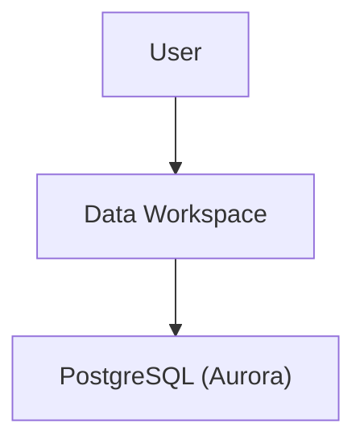
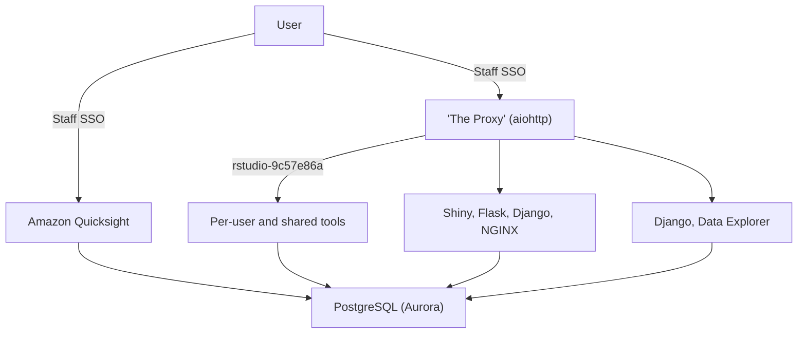

The architecture is heavily Docker/Fargate based.

## High level architecture

At the highest level, users access the Data Workspace application, which accesses a PostgreSQL database.

## Medium level architecture

## User-facing

- [Main application](https://quay.io/repository/uktrade/data-workspace):
  A Django application to manage datasets and permissions, launch containers, a proxy to route requests to those containers, and an NGINX instance to route to the proxy and serve static files.

- [JupyterLab](https://quay.io/repository/uktrade/data-workspace-jupyterlab):
  Launched by users of the main application, and populated with credentials in the environment to access certain datasets.

- [rStudio](https://quay.io/repository/uktrade/data-workspace-rstudio):
  Launched by users of the main application, and populated with credentials in the environment to access certain datasets.

- [pgAdmin](https://quay.io/repository/uktrade/data-workspace-pgadmin): 
  Launched by users of the main application, and populated with credentials in the environment to access certain datasets.

- File browser:
  A single-page-application that offers upload and download of files to/from each user's folder in S3. The data is transferred directly between the user's browser and S3.

## Infrastructure

- [metrics](https://quay.io/repository/uktrade/data-workspace-metrics):
  A sidecar-container for the user-launched containers that exposes metrics from the [ECS task metadata endpoint](https://docs.aws.amazon.com/AmazonECS/latest/developerguide/task-metadata-endpoint-v3.html) in Prometheus format.

- [s3sync](https://quay.io/repository/uktrade/data-workspace-s3sync):
  A sidecar-container for the user-launched containers that syncs to and from S3 using [mobius3](https://github.com/uktrade/mobius3). This is to allow file-persistance on S3 without using FUSE, which at the time of writing is not possible on Fargate.

- [dns-rewrite-proxy](https://quay.io/repository/uktrade/data-workspace-dns-rewrite-proxy):
  The DNS server of the VPC that launched containers run in. It selectively allows only certain DNS requests through to migitate chance of data exfiltration through DNS. When this container is deployed, it changes DHCP settings in the VPC, and will most likely break aspects of user-launched containers.

- [healthcheck](https://quay.io/repository/uktrade/data-workspace-healthcheck):
  Proxies through to the healthcheck endpoint of the main application, so the main application can be in a security group locked-down to certain IP addresses, but still be monitored by Pingdom.

- [mirrors-sync](https://quay.io/repository/uktrade/data-workspace-mirrors-sync):
  Mirrors pypi, CRAN and (ana)conda repositories to S3, so user-launched JupyterLab and rStudio containers can install packages without having to contact the public internet.

- [prometheus](https://quay.io/repository/uktrade/data-workspace-prometheus):
  Collects metrics from user-launched containers and re-exposes them through federation.

- [registry](https://quay.io/repository/uktrade/data-workspace-registry):
  A Docker pull-through-cache to repositories in [quay.io](https://quay.io/organization/uktrade). This allows the VPC to not have public internet access but still launch containers from quay.io in Fargate.

- [sentryproxy](https://quay.io/repository/uktrade/data-workspace-sentryproxy):
  Proxies errors to a Sentry instance: only used by JupyterLab.
