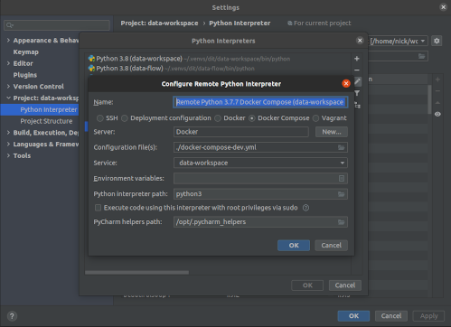
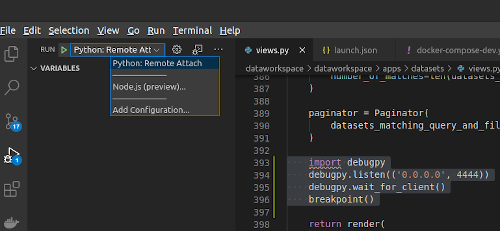
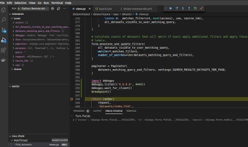

# Remote debugging containers

## PDB

As `ipdb` has some issues with gevent and monkey patching we are only able to debug using vanilla `pdb` currently.

To set this up locally:

1. Install remote-pdb-client `pip install remote-pdb-client` or just `pip install -r requirements-dev.txt`. 
2. Ensure you have the following in `dev.env`:
    - `PYTHONBREAKPOINT=remote_pdb.set_trace`
    - `REMOTE_PDB_HOST=0.0.0.0`
    - `REMOTE_PDB_PORT=4444`
3. Sprinkle some `breakpoint()`s liberally in your code.
4. Bring up the docker containers `docker compose up`. 
5. Listen to remote pdb using `remotepdb_client --host localhost --port 4444`.
6. Go and break things [http://dataworkspace.test:8000](http://dataworkspace.test:8000).

## Pycharm

To debug via the pycharm remote debugger you will need to jump through a few hoops:

1. Configure `docker-compose.yml` as a remote interpreter:  
    

2. Configure a python debug server for `pydev-pycharm` to connect to. You will need to ensure the path mapping 
is set to the path of your dev environment:  
    

3. Bring up the containers: 
    ` docker compose up`

4. Start the pycharm debugger:  
    

5. Add a breakpoint using pydev-pycharm:  
    

4. Profit:  
    

## VSCode

Below are the basic steps for debugging remotely with vscode. They are confirmed to work but may needs some tweaks so feel free to update the docs:

1. Install the Docker and Python debug plugins.
2. Add a remote debug configuration to your `launch.json`:
    ```json
    {
      "configurations": [
        {
          "name": "Python: Remote Attach",
          "type": "python",
          "request": "attach",
          "connect": {
            "host": "0.0.0.0",
            "port": 4444
          },
          "pathMappings": [
            {
              "localRoot": "${workspaceFolder}/dataworkspace",
              "remoteRoot": "/dataworkspace"
            }
          ]
        }
      ]
    }
    ```
3. Add the following code snippet to the file that you wish to debug:
    ```python
    import debugpy
    debugpy.listen(('0.0.0.0', 4444))
    debugpy.wait_for_client()
    ```
4. Set a breakpoint in your code:  
    `breakpoint()`
5. Bring up the containers:  
    `docker compose up`
6. Start the remote python debugger:  
    
7. Load the relevant page [http://dataworkspace.test:8000](http://dataworkspace.test:8000).
8. Start debugging: 
    
